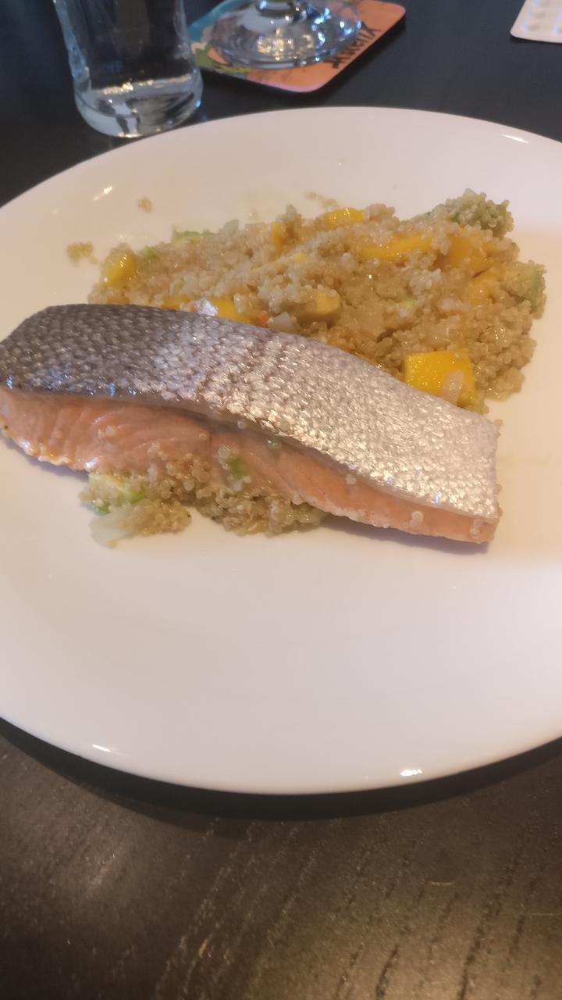

<!--
.. title: Avocado-Mango-Quinotto mit Lachs
.. slug: avocado-mango-quinotto-mit-lachs
.. date: 2020-04-11 17:53:07 UTC+02:00
.. tags: 
.. category: 
.. link: 
.. description: 
.. type: text
-->

# Avocado-Mango Quinotto mit Lachs

## Zutaten

* 1 Avocado
* 1 Mango 
* 250g Quinoa, 250mL Weißwein, 500ml Gemüsebrühe
* 1- 2 Zwiebeln 
* Salz, Pfeffer, Kokos Öl, (Zitronensaft)
* 2 Lachs-Filets

## Zubereitung

Avocado, Mango, Zwiebel klein würfeln. Zwiebel in Kokosöl andünsten. Quinoa kurz mit anschwitzen. Mit Weißwein ablöschen. Nach und nach Brühe an- gießen und rühren (ca 15 Minuten). Parallel Lachs z.B. im Dampfgarer (18  Minuten) garen. 

Zuletzt Avocado und Mango dazugeben und mit Ge­würzen abschmecken. 

Lachs und Quinotto auf Teller separat anrichten. 